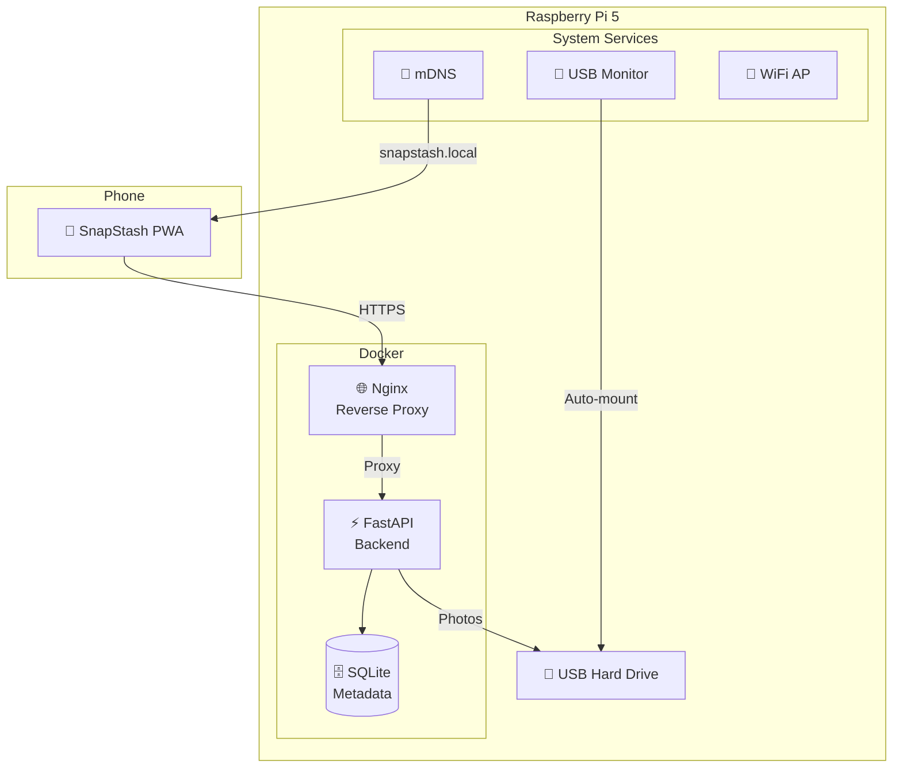

# 📸 SnapStash

### Your Private Photo Cloud — Zero Config, Zero Cloud

[](https://github.com/YOUR_USERNAME/SnapStash/actions)
[](LICENSE)

> Plug in a Raspberry Pi 5 + a USB hard drive. Scan a QR code with your phone.
> Start backing up photos. **That's it.**

SnapStash is an open-source, self-hosted photo backup appliance. No cloud accounts, no subscriptions, no data leaving your home. Your photos are stored on **your** hard drive, connected to **your** Raspberry Pi.

---

## ✨ Features

| Feature | Description |
|---|---|
| 🔌 **Zero Config** | Plug in Pi + HDD → auto-mounts and creates storage structure |
| 📱 **PWA** | Installable like a native app — splash screen, no address bar |
| 🌙 **Night Shift Sync** | Wake Lock keeps screen on; plug in and sleep while it backs up |
| 🧠 **Intelligent Diff** | SHA-256 deduplication — only uploads new photos |
| 📦 **Chunked Upload** | Handles 4K videos up to 10GB without crashing |
| 📡 **mDNS Discovery** | Broadcasts as `snapstash.local` — no IP addresses to remember |
| 📶 **WiFi Hotspot** | Creates a setup WiFi network when no internet is available |
| 🐳 **Dockerized** | One `docker compose up` and you're running |
| 💾 **Flash-Ready ISO** | GitHub Actions builds a ready-to-flash Raspberry Pi image |

---

## 🏗️ Architecture



---

## 🚀 3-Step Quickstart

### 1. 📥 Flash
Download the latest SnapStash image from [Releases](../../releases) and flash it to a microSD card using [Raspberry Pi Imager](https://www.raspberrypi.com/software/).

### 2. 🔌 Plug
Insert the SD card into your Raspberry Pi 5. Plug in a USB hard drive. Connect Ethernet (or it will create a `SnapStash-Setup` WiFi network). Power on.

### 3. 📱 Scan
Open your phone's camera and scan the QR code displayed at `http://snapstash.local`. Install the PWA and tap **Start Backup**.

> **That's it.** Your photos are now being backed up to your own hard drive. 🎉

---

## 🛠️ Development Setup

### Prerequisites
- Python 3.11+
- Node.js 18+
- Docker & Docker Compose (optional)

### Backend
```bash
cd backend
python3 -m venv .venv
source .venv/bin/activate
pip install -r requirements.txt

# Set local storage paths
export SNAPSTASH_STORAGE_PATH="./data/photos"
export SNAPSTASH_TEMP_PATH="./data/temp"
export SNAPSTASH_DB_PATH="./data/metadata.db"

uvicorn app.main:app --reload --port 8000
```

### Frontend
```bash
cd frontend
npm install
npm run dev
```

The frontend dev server proxies `/api/*` to `localhost:8000`.

### Docker (Full Stack)
```bash
docker compose build
docker compose up
```

Open `http://localhost` in your browser.

---

## 📁 Project Structure

```
SnapStash/
├── backend/          # FastAPI server (Python)
│   ├── app/
│   │   ├── main.py          # App entrypoint
│   │   ├── routers/         # API endpoints
│   │   ├── services/        # Business logic
│   │   └── models.py        # SQLAlchemy models
│   └── Dockerfile
├── frontend/         # React/Vite PWA
│   ├── src/
│   │   ├── components/      # UI components
│   │   ├── hooks/           # React hooks
│   │   └── api/             # Backend client
│   └── Dockerfile
├── services/         # System services (Raspberry Pi)
│   ├── usb_monitor.py       # USB auto-mount
│   ├── mdns_broadcaster.py  # mDNS discovery
│   └── wifi_hotspot.py      # WiFi AP fallback
├── nginx/            # Reverse proxy
├── pi-gen-stage/     # Custom Pi image build
├── docker-compose.yml
└── .github/workflows/
    └── build-image.yml       # CI/CD pipeline
```

---

## 🔒 Privacy & Security

- **No cloud.** All data stays on your local hard drive.
- **No accounts.** No login required on your local network.
- **No telemetry.** Zero data sent anywhere.
- **SHA-256 verification.** Every upload is verified for integrity.
- **Self-signed HTTPS.** TLS on the local network for secure API calls.

---

## 📋 Tech Stack

| Layer | Technology |
|---|---|
| Backend | Python 3.11, FastAPI, SQLAlchemy, aiofiles, SQLite |
| Frontend | React 18, Vite 5, vite-plugin-pwa |
| Proxy | Nginx |
| Container | Docker, Docker Compose |
| Discovery | Zeroconf (mDNS), Avahi |
| Hardware | Raspberry Pi 5, USB HDD |
| CI/CD | GitHub Actions, pi-gen |

---

## 🤝 Contributing

Contributions are welcome! Please:

1. Fork the repository
2. Create a feature branch (`git checkout -b feature/amazing`)
3. Commit your changes (`git commit -m 'Add amazing feature'`)
4. Push to the branch (`git push origin feature/amazing`)
5. Open a Pull Request

---

## 📄 License

This project is licensed under the MIT License — see the [LICENSE](LICENSE) file for details.

---

<p align="center">
  Made with 💙 for privacy-conscious photographers everywhere.
</p>